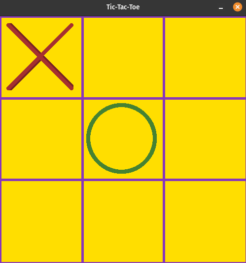

# Pygame Tic Tac Toe

A simple Tic Tac Toe game implemented using Pygame. This project allows you to play the classic game against another player on the same machine. The game features a start menu and keeps track of the score, allowing for continuous play.

## Features

- Two-player mode
- Start menu with Play and Quit options
- Continuous gameplay with scorekeeping
- Simple and intuitive interface

## Screenshots

 <!-- Replace with your actual screenshot -->

## TODO

- [ ] Add Player vs Player button on the menu
- [ ] Add Player vs CPU button on the menu

## Getting Started

### Prerequisites

To run this project, you need to have Python and Pygame installed on your machine.

- Python 3.x
- Pygame

### Installation

1. Clone the repository:

   ```bash
   git clone https://github.com/Vagonas1/TicTacToe.git
   cd TicTacToe
   
